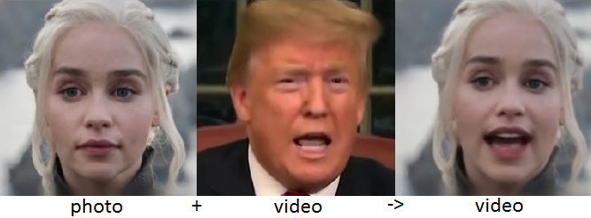

# Face-Image-Motion-Model

**Check how it works on Google Colab:**
- Russian Language _Rus.ipynb)
- English Language _Eng.ipynb)

*If there are errors, you can find a solution [HERE](https://youtu.be/j9Yq6t4hUeA)*

**Based on:** [first-order-model](https://github.com/AliaksandrSiarohin/first-order-model)

**Special thanks for the help in creating Colabs I express to [JamesCullum](https://github.com/JamesCullum)**

The videos on the left show the driving videos. The first row on the right for each dataset shows the source videos. The bottom row contains the animated sequences with motion transferred from the driving video and object taken from the source image.

**In addition, there are:**
- [VFIASC](https://github.com/sniklaus/sepconv-slomo)
- [ESRGAN](https://github.com/xinntao/ESRGAN)
- [EDVR](https://github.com/xinntao/EDVR) (new)

**Result Example:**

